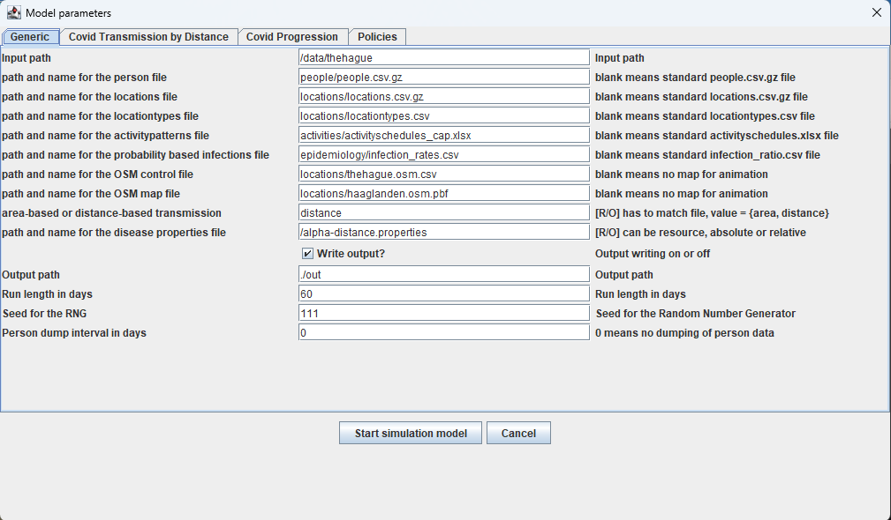

# medlabs-heros

### Agent-Based Model of Covid-19 spread in European cities for the [HERoS project](https://www.heros-project.eu/)

#### Models and libraries

The models have been heavily based on the PhD thesis work of Minxing Zhang at TU Delft, which has been described in detail in the following literature references:

- Zhang, Mingxin. Large-scale agent-based social simulation. A study on epidemic prediction and control. Doctoral Thesis (2016). Delft University of Technology, The Netherlands. doi: https://doi.org/10.4233/uuid:8d0f67a3-d8e6-43ee-acc5-1633c617e023
- Zhang, Mingxin, Verbraeck, Alexander, Meng, Rongqing, Chen, Bin and Qiu, Xiaogang (2016) 'Modeling Spatial Contacts for Epidemic Prediction in a Large-Scale Artificial City' Journal of Artificial Societies and Social Simulation 19 (4) 3 <http://jasss.soc.surrey.ac.uk/19/4/3.html>. doi: 10.18564/jasss.3148


#### The build-up of the libraries is as follows:

<table>
  <tr><td>HERoS library for Covid-19 spread in cities (https://www.heros-project.eu/)</td></tr>
  <tr><td>MEDLABS disease transmission library (https://simulation.tudelft.nl/medlabs)</td></tr>
  <tr><td>DSOL simulation library (https://simulation.tudelft.nl)</td></tr>
  <tr><td>djutils (https://djutils.org)</td></tr>
  <tr><td>djunits (https://djunits.org)</td></tr>
  <tr><td>djutils-base (https://djutils.org)</td></tr>
</table>

Using Maven, all libraries are resolved automatically for the HERoS project library. There is also a 'fat jar' in the folder `jar` that contains the heros library plus all libraries on which it is dependent.


#### Java version

HERoS and the libraries on which it is dependent, use a Java version 17 or higher. The library is typically used with an openjdk version 17.


#### Instructions for interactive run

1. Make sure a Java version 17.0 or higher is installed on the computer, and can be reached from the command line / shell. Test with `java -version`:

```
java -version
openjdk version "17.0.2" 2022-01-18
OpenJDK Runtime Environment (build 17.0.2+8-86)
OpenJDK 64-Bit Server VM (build 17.0.2+8-86, mixed mode, sharing)
```

When the version is 17 or higher, Java can run the heros model.


2. Download the contents of the `jar` folder and unpack into a folder on disk, preferaby one without spaces in the file path. It should have the following content:

```
|-- medlabs-heros-full-2.1.4.jar
|-- default.properties
|-- alpha-distance.properties
|-- data
    |-- thehague
        |-- activities
            |-- activityschedule.xlsx
        |-- epidemiology
            |-- infection_rates.csv
            |-- transition_probabilities.xlsx
        |-- locations
            |-- locationtypes.csv
            |-- locations.csv.gz
            |-- thehague.osm.csv [description of files used in animation]
            |-- thehague.osm.pbf [example openstreetmap file for background]
            |-- haaglanden.osm.pbf [example OSM file of a wider region]
        |-- people
            |-- people.csv.gz
        |-- policies
            |-- HardLockdown_00.csv [could be many policies]
```

3. Go into the folder of the jar file, and run it with:

```
java -jar medlabs-heros-full-2.1.4.jar
```

It will find the file `default.properties` and read the information to find all other files needed to run the experiment. It will show a confirmation screen of the configuration in `default.properties`:



Final tweaks can be made here, after which the model runs, either in batch mode or in interactive mode.

